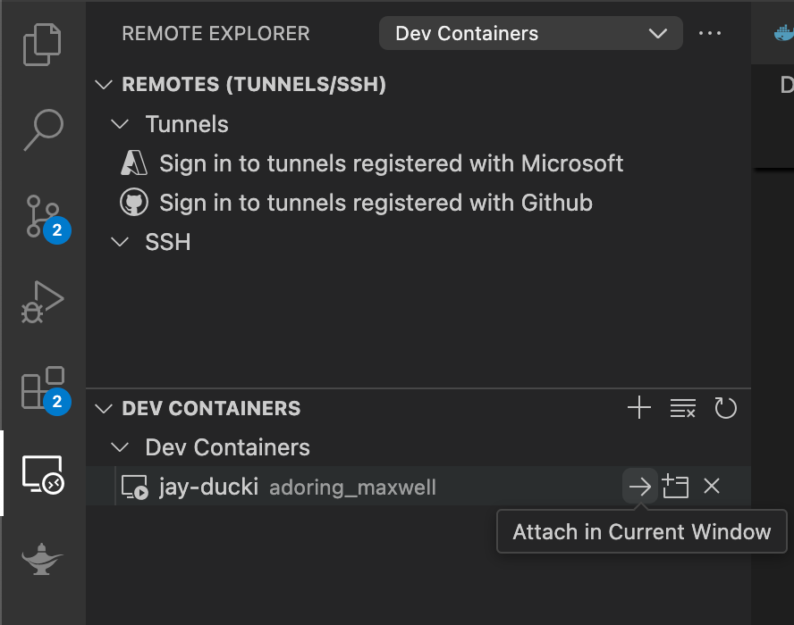

# Create T3 App

This is a [T3 Stack](https://create.t3.gg/) project bootstrapped with `create-t3-app`.

## What's next? How do I make an app with this?

We try to keep this project as simple as possible, so you can start with just the scaffolding we set up for you, and add additional things later when they become necessary.

If you are not familiar with the different technologies used in this project, please refer to the respective docs. If you still are in the wind, please join our [Discord](https://t3.gg/discord) and ask for help.

- [Next.js](https://nextjs.org)
- [NextAuth.js](https://next-auth.js.org)
- [Prisma](https://prisma.io)
- [Drizzle](https://orm.drizzle.team)
- [Tailwind CSS](https://tailwindcss.com)
- [tRPC](https://trpc.io)

## Learn More

To learn more about the [T3 Stack](https://create.t3.gg/), take a look at the following resources:

- [Documentation](https://create.t3.gg/)
- [Learn the T3 Stack](https://create.t3.gg/en/faq#what-learning-resources-are-currently-available) — Check out these awesome tutorials

You can check out the [create-t3-app GitHub repository](https://github.com/t3-oss/create-t3-app) — your feedback and contributions are welcome!

## How do I deploy this?

Follow our deployment guides for [Vercel](https://create.t3.gg/en/deployment/vercel), [Netlify](https://create.t3.gg/en/deployment/netlify) and [Docker](https://create.t3.gg/en/deployment/docker) for more information.

## Running in Docker
Prereq: Have docker installed.

Steps:
1. Clone this Repo
2. Create a `.env` with the required env variables
3. Run `docker build --no-cache -t ducki .`
    - This will create an image with name `ducki`
4. Create a container by running `docker run -d -p 3000:3000 ducki`
    - This is assuming Ducki will run on `http://localhost:3000/`
5. Run `docker ps` to get the name of the container. It will be listed under `NAMES`
6. Open VS Code
    - Make sure to have `Remote Explorer` extensions installed
    - Go to the `Remote Explorer` extension, select `Dev Containers` from the dropdown, and then click into your container (`Attach in Current Window`, and my container's name is `adoring_maxwell`)
    
7. Navigate to `/app`
8. Now you should be able to run `npm run dev` to run your service
9. Run `http://localhost:3000/` in Chrome to test.

Note: this will keep the container running. To kill the container, you can run `docker stop <container_name(adoring_maxwell)>`. Once you stop the container, you will lose all progress. Also, beware developing from docker container. You may have to take additional steps to enable your container to access GitHub, making development more difficult. This is just a start / proof-of-concept.